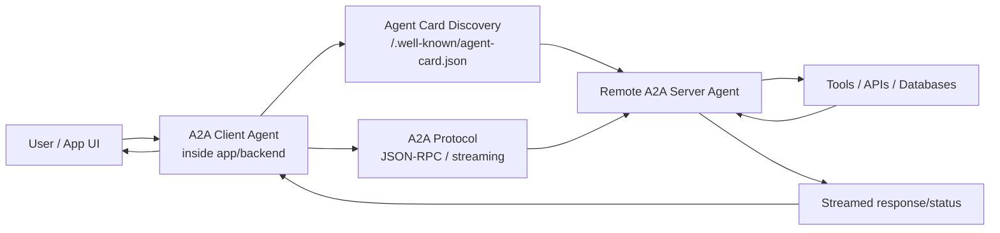
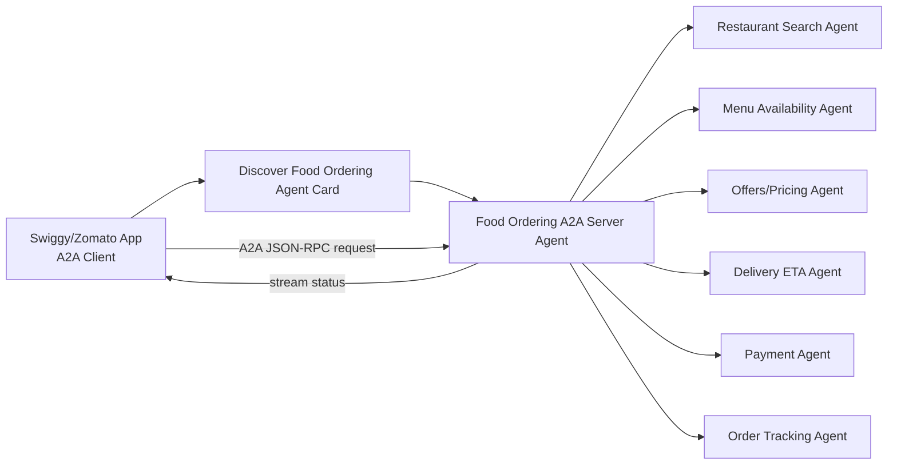
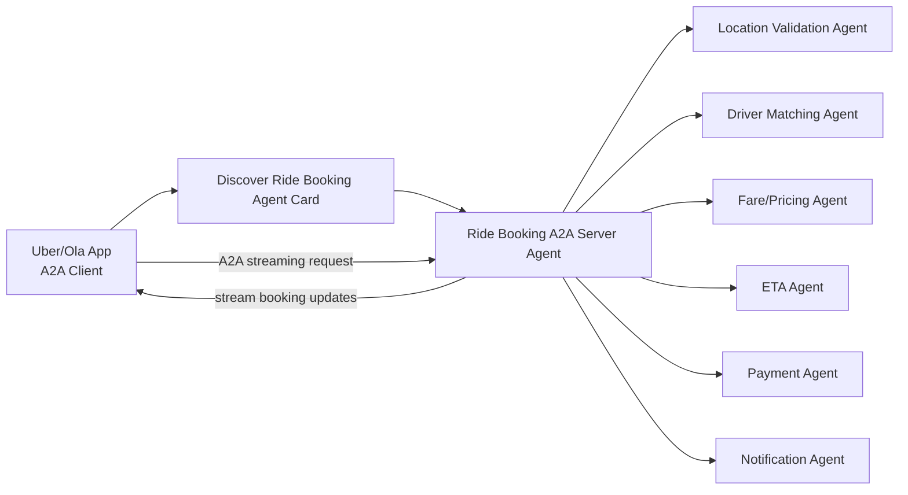
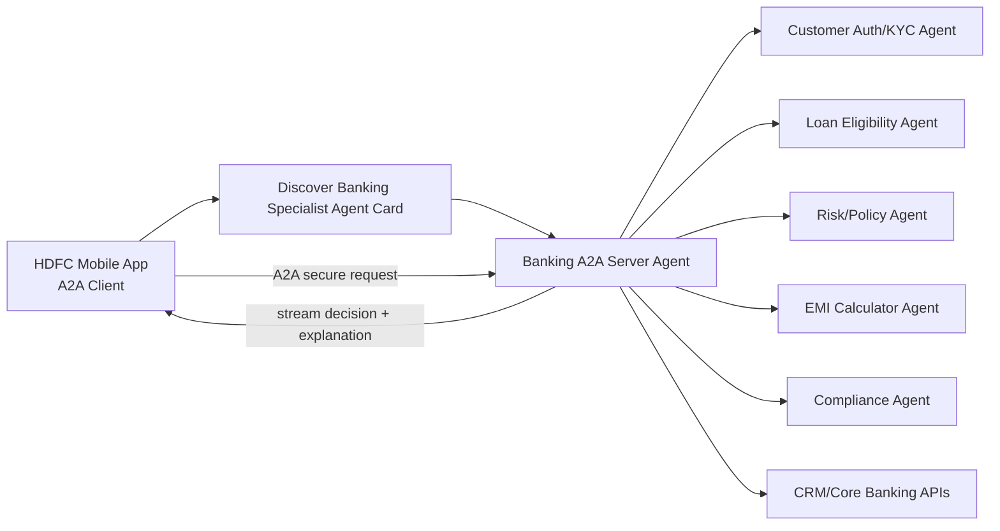
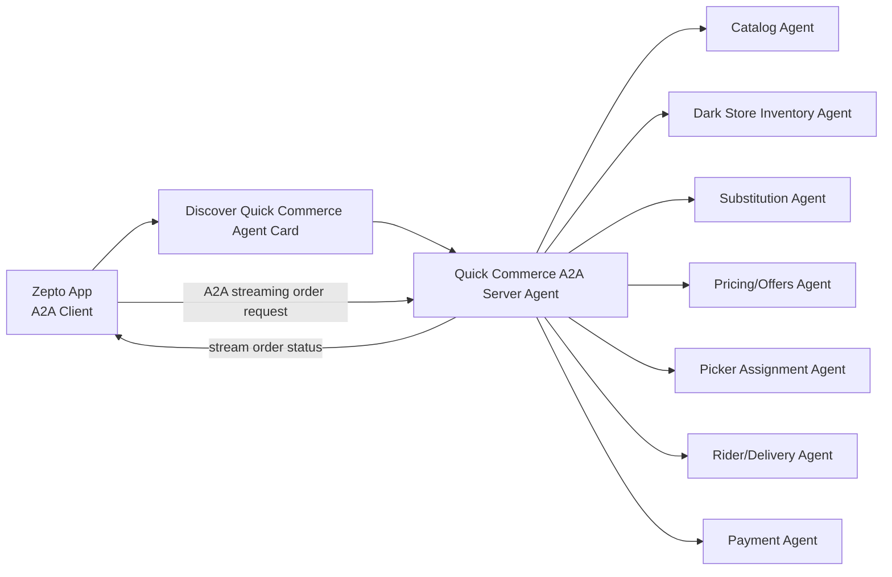
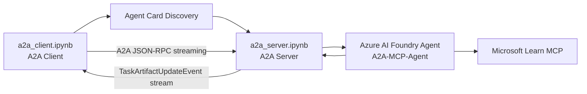

# A2A Protocol Real-World Examples

This document explains how an A2A client and A2A server can work in real product scenarios. The examples are conceptual and map common application workflows to A2A-style agent-to-agent communication.

## Core A2A Pattern



## 1. Swiggy / Zomato Food Ordering

### Use Case

A customer asks the app to find food, apply offers, place an order, and track delivery.

Example user input:

```text
Order chicken biryani near Indiranagar under Rs. 400 and deliver it quickly.
```

### Wiring Diagram



### Steps

1. App sends user request to the remote food ordering A2A server.
2. Server checks restaurants near the user.
3. Menu agent confirms item availability.
4. Offers agent applies coupons and calculates price.
5. Delivery agent estimates delivery time.
6. Payment agent validates UPI/card/wallet.
7. Order tracking agent streams live updates.

### Streamed Output Example

```text
Finding restaurants near Indiranagar...
Found biryani at 4 restaurants.
Applying best coupon...
Final price: Rs. 372.
Assigning delivery partner...
Order confirmed. ETA 31 minutes.
```

## 2. Uber / Ola Cab Booking

### Use Case

A customer asks the app to book a ride from pickup to destination.

Example user input:

```text
Book a cab from HSR Layout to Bangalore Airport for 2 passengers.
```

### Wiring Diagram



### Steps

1. App sends pickup, drop, passenger count, and ride preference.
2. Location agent validates pickup/drop coordinates.
3. Pricing agent calculates estimated fare.
4. ETA agent estimates pickup and trip duration.
5. Driver matching agent finds nearby drivers.
6. Payment agent performs pre-check.
7. Notification agent sends ride confirmation.

### Streamed Output Example

```text
Validating pickup location...
Estimating fare...
Estimated fare: Rs. 1,250.
Searching nearby drivers...
Driver Ravi accepted. Pickup ETA: 4 minutes.
Ride confirmed.
```

## 3. HDFC Bank / Banking Assistant

### Use Case

A customer asks a banking app for loan eligibility, card support, fraud help, or transaction assistance.

Example user input:

```text
Check if I am eligible for a personal loan of Rs. 5 lakhs and explain the EMI options.
```

### Wiring Diagram



### Steps

1. Mobile app authenticates the user and sends the request.
2. Banking A2A server receives the request.
3. Auth/KYC agent confirms customer identity and consent.
4. Eligibility agent checks income, account history, and credit rules.
5. Risk/policy agent applies bank policy.
6. EMI agent calculates possible repayment plans.
7. Compliance agent ensures the response follows regulatory language.

### Streamed Output Example

```text
Verifying customer profile...
Checking eligibility...
Calculating EMI options...
You may be eligible for Rs. 5 lakhs subject to final verification.
Example EMI for 36 months: Rs. XX,XXX.
Please review terms before applying.
```

## 4. Zepto / Quick Commerce Delivery

### Use Case

A customer asks for groceries or essentials with fast delivery.

Example user input:

```text
Send milk, bread, eggs, and bananas to my home in 10 minutes if available.
```

### Wiring Diagram



### Steps

1. App sends basket and delivery location.
2. Catalog agent normalizes item names.
3. Inventory agent checks the nearest dark store.
4. Substitution agent suggests replacements for unavailable items.
5. Pricing agent applies discounts and computes total.
6. Picker agent assigns a store picker.
7. Delivery agent assigns a rider.
8. Payment agent confirms payment.

### Streamed Output Example

```text
Checking nearest dark store...
Milk, bread, eggs, and bananas are available.
Applying offers...
Assigning picker...
Rider assigned. Delivery ETA: 9 minutes.
Order confirmed.
```

## How This Maps to Your Current A2A Demo

Your current notebooks follow the same pattern:



In production, replace the demo Foundry/MCP backend with domain-specific systems:

| Demo component | Real-world equivalent |
| --- | --- |
| `a2a_client.ipynb` | Mobile app, web app, call center app, Teams bot |
| `a2a_server.ipynb` | Remote business capability agent |
| `A2A-MCP-Agent` | Domain specialist agent |
| Microsoft Learn MCP | Restaurant APIs, bank APIs, logistics APIs, inventory APIs |
| Streaming output | Live order, booking, eligibility, or delivery updates |

## Why A2A Helps

- The client does not need to know every backend service.
- Each remote agent publishes its capabilities through an Agent Card.
- Teams can own independent agents: payments, delivery, pricing, risk, inventory.
- Streaming responses provide real-time progress updates.
- The same protocol pattern works across food, mobility, banking, and logistics.

