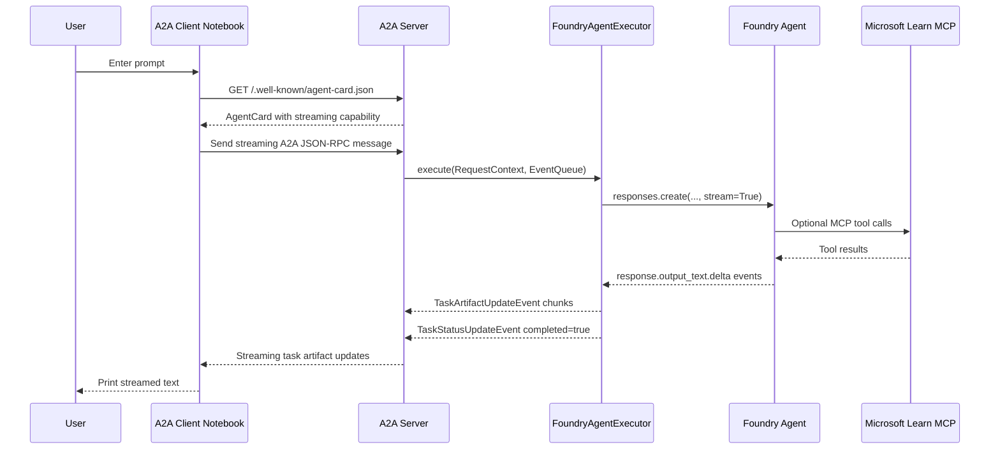

# A2A and MCP Application Logic

This folder contains a notebook-based demo where an A2A client talks to an A2A server. The A2A server wraps a Microsoft Foundry Agent, and that Foundry Agent is configured with a Microsoft Learn MCP tool.

## Files

- `a2a_server.ipynb`: starts the A2A server on `http://localhost:8080`.
- `a2a_client.ipynb`: discovers the server's Agent Card and sends a streaming A2A request.
- `.env`: provides the Foundry project endpoint, model deployment name, and MCP connection name.

## Runtime Roles

| Runtime block | Location | Responsibility |
| --- | --- | --- |
| A2A Client | `a2a_client.ipynb` | Discovers the remote agent, creates an A2A client, sends a user message, and prints streamed output. |
| A2A Server | `a2a_server.ipynb` | Publishes the Agent Card and accepts A2A JSON-RPC messages. |
| Agent Card | Server public metadata | Describes the server agent, supported input/output modes, streaming capability, and skill examples. |
| `FoundryAgentExecutor` | Server adapter | Converts A2A requests into Foundry Agent calls and converts Foundry streaming deltas into A2A task artifact events. |
| Foundry Agent | Azure AI Foundry | Runs the model deployment and instructions. |
| MCP Tool | Microsoft Learn MCP server | Gives the Foundry Agent tool access to Microsoft Learn content. |

## Wiring Schematic

```mermaid
flowchart LR
    User["User prompt in a2a_client.ipynb"]
    Client["A2A Client\nClientFactory + JSON-RPC streaming"]
    Resolver["A2ACardResolver\nGET /.well-known/agent-card.json"]
    Server["A2A Server\nA2AStarletteApplication on :8080"]
    Card["Agent Card\nskills + streaming=true"]
    Handler["DefaultRequestHandler\nInMemoryTaskStore"]
    Executor["FoundryAgentExecutor\nA2A -> Foundry adapter"]
    FoundryWrapper["FoundryAgent.invoke_agent_stream"]
    Foundry["Microsoft Foundry Agent\nA2A-MCP-Agent"]
    MCP["Microsoft Learn MCP Server\nhttps://learn.microsoft.com/api/mcp"]
    Stream["TaskArtifactUpdateEvent stream\ncurrent_result deltas"]

    User --> Client
    Client --> Resolver
    Resolver -->|discovers metadata| Card
    Card --> Server
    Client -->|message/send streaming JSON-RPC| Server
    Server --> Handler
    Handler --> Executor
    Executor --> FoundryWrapper
    FoundryWrapper --> Foundry
    Foundry -->|tool call when needed| MCP
    MCP --> Foundry
    Foundry -->|response.output_text.delta| FoundryWrapper
    FoundryWrapper --> Executor
    Executor --> Stream
    Stream --> Client
    Client --> User
```

## Sequence Logic

## Important Endpoints

| Endpoint | Purpose |
| --- | --- |
| `http://localhost:8080/.well-known/agent-card.json` | Public A2A Agent Card discovery endpoint used by `A2ACardResolver`. |
| `http://localhost:8080/` | A2A JSON-RPC message endpoint used by the client transport. |
| `https://learn.microsoft.com/api/mcp` | Remote MCP server used by the Foundry Agent. |

## Environment Variables

| Variable | Used by | Meaning |
| --- | --- | --- |
| `FOUNDRY_PROJECT_ENDPOINT` | Server | Azure AI Foundry project endpoint. |
| `MODEL_DEPLOYMENT_NAME` | Server | Model deployment used by the Foundry prompt agent. |
| `MCP_SERVER_NAME` | Server | Name of the existing Foundry project connection for the MCP server. |

## Key Application Behavior

1. The server loads `.env` and creates an `AIProjectClient`.
2. The server searches Foundry project connections for `MCP_SERVER_NAME`.
3. The server builds an `MCPTool` pointing to Microsoft Learn MCP.
4. The server creates a Foundry prompt agent named `A2A-MCP-Agent`.
5. The server wraps that Foundry agent in `FoundryAgentExecutor`.
6. The server publishes an A2A `AgentCard` that declares text input/output and streaming support.
7. The client resolves the Agent Card before sending work.
8. The client creates a JSON-RPC streaming A2A client from the discovered card.
9. The client sends a text message.
10. The server streams Foundry response deltas back as A2A task artifact updates.

