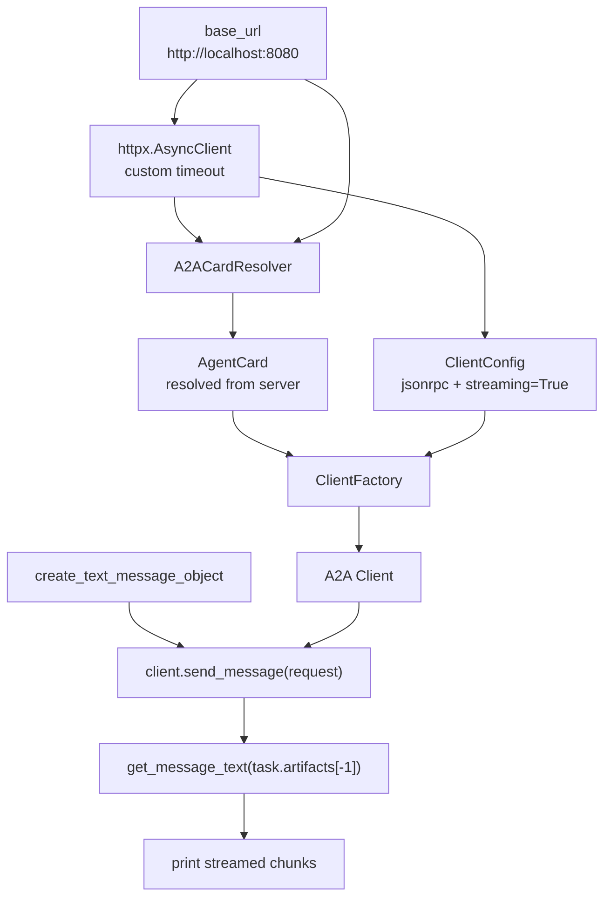

# Client Application Logic

Source notebook: `a2a_client.ipynb`

## Purpose

The client discovers an A2A server, creates a protocol-compatible A2A client, sends a text request, and prints streaming artifact updates from the remote agent.

## Client Components



## Client Request Path

```python
base_url = "http://localhost:8080"
async with httpx.AsyncClient(timeout=...) as httpx_client:
    resolver = A2ACardResolver(httpx_client=httpx_client, base_url=base_url)
    agent_card = await resolver.get_agent_card()

    config = ClientConfig(
        httpx_client=httpx_client,
        supported_transports=[TransportProtocol.jsonrpc],
        streaming=True,
    )

    client = ClientFactory(config).create(agent_card)
    request = create_text_message_object(
        content="Tell me how to create an Azure Storage Account using Azure CLI."
    )

    async for response in client.send_message(request):
        task, _ = response
        print(get_message_text(task.artifacts[-1]), end="", flush=True)
```

## Client Execution Steps

1. Create an `httpx.AsyncClient` with explicit connect, read, write, and pool timeouts.
2. Create `A2ACardResolver` using `http://localhost:8080`.
3. Fetch the public Agent Card from the A2A server.
4. Create `ClientConfig` with JSON-RPC transport and streaming enabled.
5. Use `ClientFactory` to create a client compatible with the resolved Agent Card.
6. Create a text A2A message object.
7. Call `client.send_message(request)`.
8. For each streamed response, read the latest task artifact.
9. Print the artifact text delta.

## Why Agent Card Discovery Matters

The client does not hard-code the remote agent's capabilities. It first asks the server for its public metadata, then uses that metadata to configure the protocol client. This is the A2A discovery step.

The discovered Agent Card tells the client:

- the remote agent name;
- supported input modes;
- supported output modes;
- whether streaming is supported;
- available skills and examples;
- the server URL to call.

