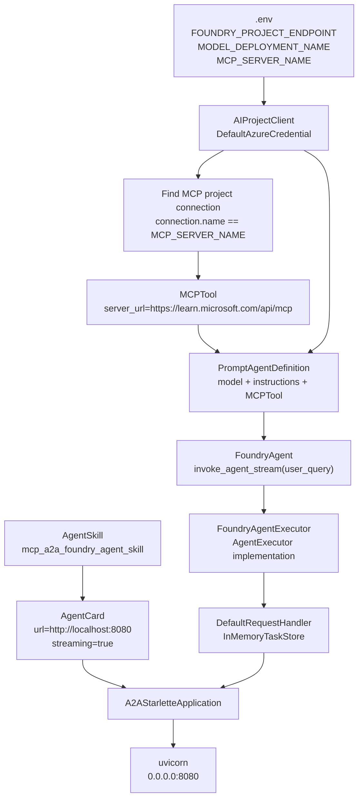

# Server Application Logic

Source notebook: `a2a_server.ipynb`

## Purpose

The server exposes a Microsoft Foundry Agent as an A2A-compatible remote agent. It uses the A2A SDK server stack to publish an Agent Card and receive JSON-RPC messages. Internally, it calls Azure AI Foundry, where the agent can use the Microsoft Learn MCP server as a tool.

## Server Components



## Request Handling Path

```python
Client message
    -> A2AStarletteApplication
    -> DefaultRequestHandler
    -> FoundryAgentExecutor.execute(context, event_queue)
    -> context.get_user_input()
    -> FoundryAgent.invoke_agent_stream(query)
    -> openai_client.responses.create(stream=True, agent_reference)
    -> yield response.output_text.delta chunks
    -> TaskArtifactUpdateEvent(name="current_result", text=delta)
    -> TaskStatusUpdateEvent(state=completed, final=True)
```

## Core Classes

### `FoundryAgent`

`FoundryAgent.invoke_agent_stream(user_query)` is the bridge to Azure AI Foundry.

It:

- creates a Foundry conversation;
- invokes `openai_client.responses.create(..., stream=True)`;
- references the created Foundry agent through `extra_body={"agent": {"name": agent.name, "type": "agent_reference"}}`;
- yields every `response.output_text.delta` as `{"content": delta, "done": False}`;
- yields a final `{"content": "", "done": True}` marker.

### `FoundryAgentExecutor`

`FoundryAgentExecutor` is the A2A adapter.

It:

- reads the user input from `RequestContext`;
- calls `FoundryAgent.invoke_agent_stream`;
- converts every Foundry delta into an A2A `TaskArtifactUpdateEvent`;
- emits `TaskStatusUpdateEvent` with `TaskState.completed` when the stream finishes.

## A2A Server Objects

| Object | Role |
| --- | --- |
| `AgentSkill` | Describes what the agent can do. |
| `AgentCard` | Public discovery contract consumed by A2A clients. |
| `DefaultRequestHandler` | Routes A2A protocol requests to the executor. |
| `InMemoryTaskStore` | Stores task state during demo execution. |
| `A2AStarletteApplication` | Builds the Starlette ASGI app for A2A endpoints. |
| `uvicorn.Server` | Hosts the A2A app on port `8080`. |

## Server Startup Logic

1. Install dependencies.
2. Load `.env`.
3. Create `AIProjectClient`.
4. Find the MCP connection ID.
5. Create `MCPTool`.
6. Create Foundry prompt agent with that MCP tool.
7. Define `FoundryAgent` wrapper.
8. Define `FoundryAgentExecutor`.
9. Create public `AgentSkill`.
10. Create public `AgentCard`.
11. Create `DefaultRequestHandler`.
12. Build `A2AStarletteApplication`.
13. Start `uvicorn` on `0.0.0.0:8080`.

