# Application-LOGIC and Agents-LOGIC

This file explains how the project works at two levels:

- **Application-LOGIC**: how the React UI, Express server, session state, document upload, and API calls work together.
- **Agents-LOGIC**: how the app selects an agent, sends the request to Azure AI Foundry, handles ReAct-style trace steps, and returns the final answer.

## 1. High-Level Block Diagram

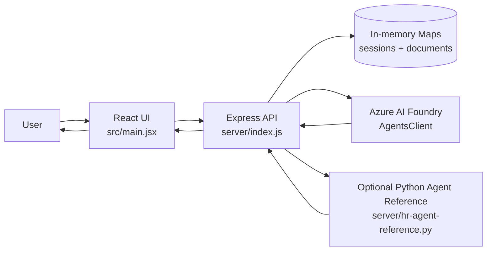

## 2. Application-LOGIC

### Step 1: App starts

1. `npm run dev` starts both:
   - React/Vite client on `http://127.0.0.1:5173`
   - Express server on `http://127.0.0.1:5000`
2. React loads `src/main.jsx`.
3. Express loads `server/index.js`.
4. Express reads Azure configuration from `.env`.
5. Express creates an Azure `AgentsClient` using credentials from `@azure/identity`.

### Step 2: UI loads runtime configuration

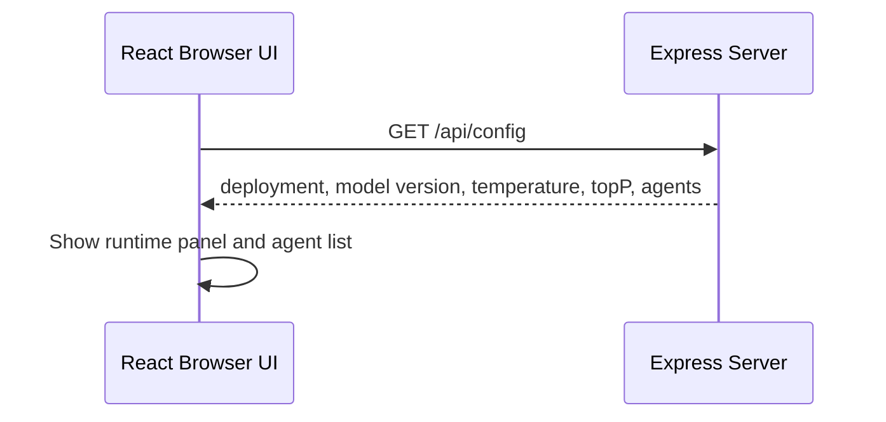

The UI calls `/api/config` on page load. The server returns public runtime metadata and the configured agent portfolio:

- General agent
- HR agent
- IT agent
- ServiceNow agent

Azure credentials and secrets stay only on the server.

### Step 3: User sends a chat message

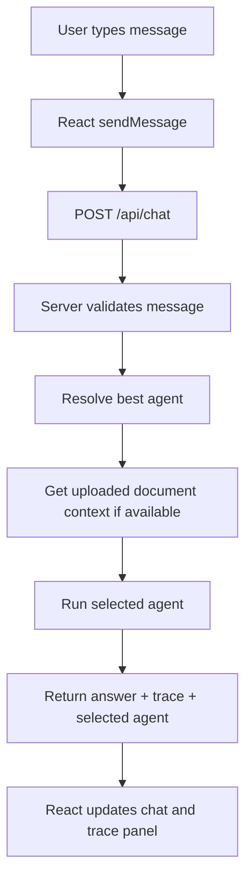

React sends this payload:

```json
{
  "message": "user request",
  "agentKey": "general/hr/it/servicenow",
  "sessionId": "session-id"
}
```

The server responds with:

```json
{
  "answer": "assistant response",
  "threadId": "azure-thread-id-or-null",
  "trace": [],
  "agent": {
    "key": "hr",
    "name": "HRAgent",
    "scope": "HR policy and employee support"
  }
}
```

### Step 4: User uploads a document

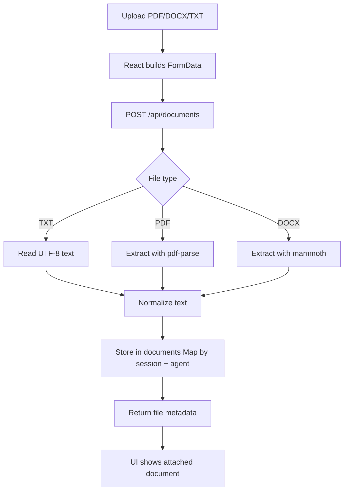

The document text is stored in server memory only. When the user asks a document-related question, the server injects the extracted text into the user message as context.

### Step 5: User generates structured output

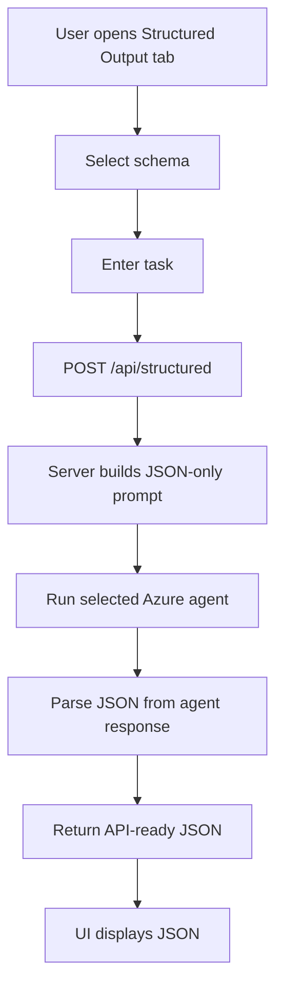

Available schemas are:

- Service ticket
- Action plan
- Document summary

## 3. Agents-LOGIC

### Agent portfolio

The Express server builds the agent list from `.env` values:

| Agent key | Purpose |
| --- | --- |
| `general` | General reasoning |
| `hr` | HR policy and employee support |
| `it` | IT helpdesk and access support |
| `servicenow` | ServiceNow ticket guidance |

### Agent selection flow

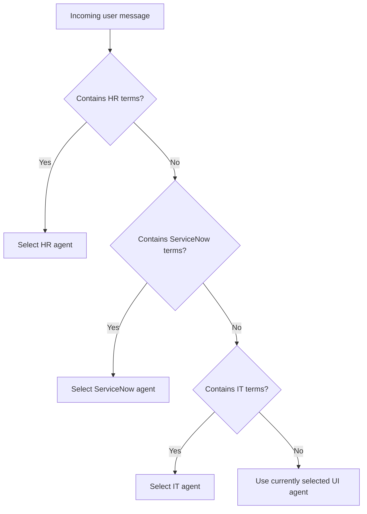

The function `resolveAgentForMessage()` performs keyword-based routing:

1. HR words route to the HR agent.
2. ServiceNow/ticketing words route to the ServiceNow agent.
3. IT/helpdesk words route to the IT agent.
4. Otherwise, the server uses the agent selected in the UI.

### ReAct-style execution

The project does not expose hidden chain-of-thought. Instead, it returns a safe operational trace:

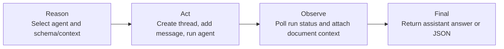

The trace shown in the UI contains stages such as:

- `Reason`: selected agent or schema
- `Act`: created/used thread, added message, called agent
- `Observe`: run completed, document context attached
- `Final`: answer or JSON received
- `Error`: server or Azure failure details

### Normal Azure AI Foundry path

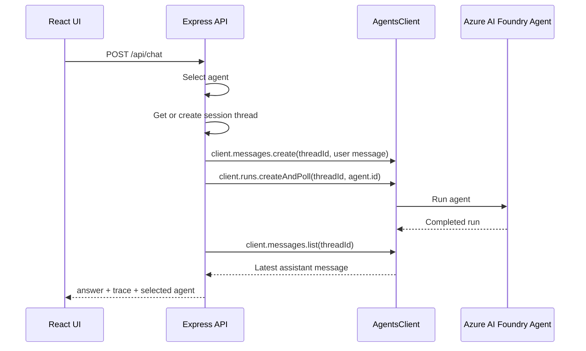

Important details:

1. A thread is reused per `sessionId + agentKey`.
2. Uploaded document context is added to the message when available.
3. `additionalInstructions` tells the agent to use a private Reason/Act/Observe loop and return only a concise answer.
4. The server polls until the run finishes.
5. The latest assistant message is returned to the browser.

### Optional Python agent-reference path

For HR, IT, or ServiceNow, the server can use an agent reference instead of the JavaScript `AgentsClient` thread path if these environment variables are configured:

- `AZURE_AI_HR_AGENT_REFERENCE_NAME`
- `AZURE_AI_IT_AGENT_REFERENCE_NAME`
- `AZURE_AI_SERVICENOW_AGENT_REFERENCE_NAME`

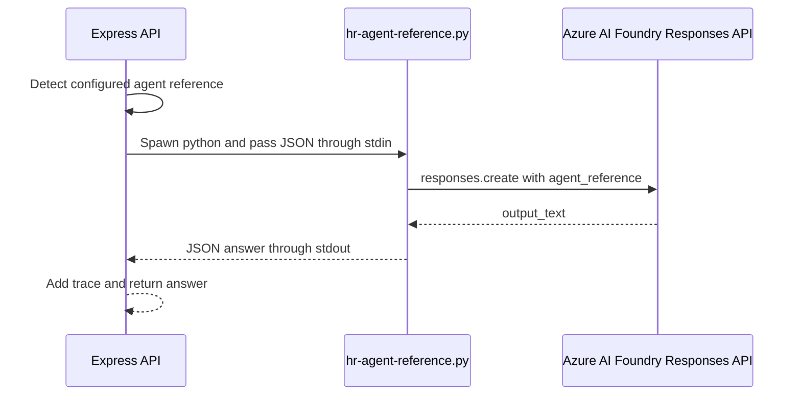

The Python script:

1. Reads JSON from `stdin`.
2. Uses `AIProjectClient`.
3. Gets an OpenAI-compatible client.
4. Calls `responses.create()` with `agent_reference`.
5. Prints `{ "answer": "..." }` to `stdout`.

## 4. Session and Document Memory

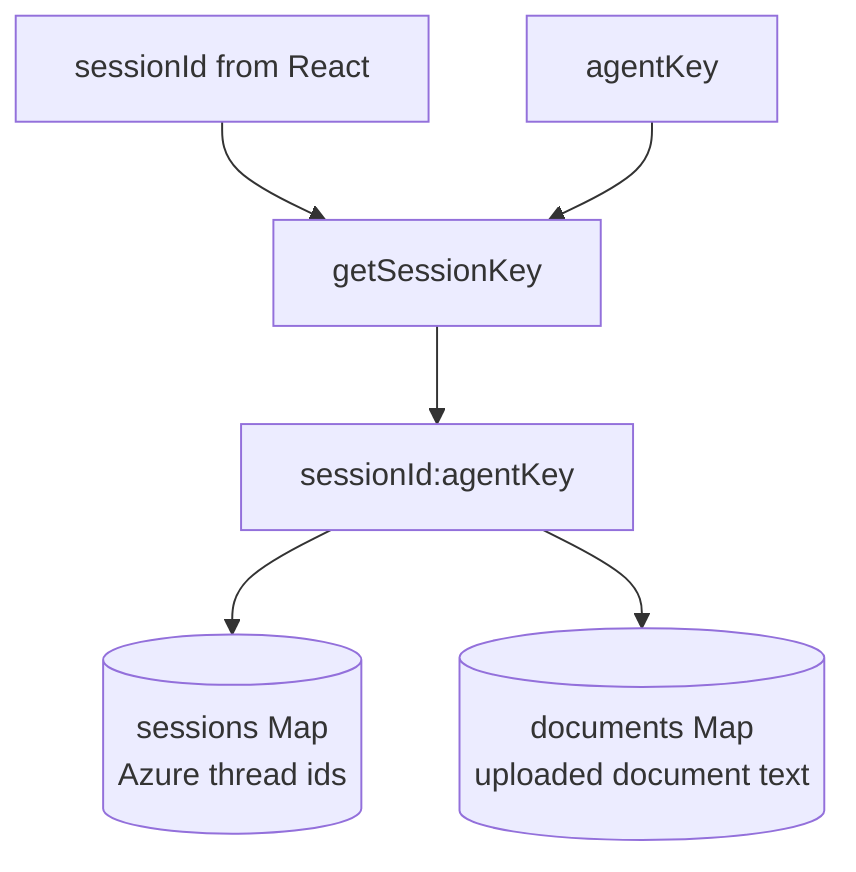

The server keeps two in-memory maps:

- `sessions`: stores Azure thread IDs by `sessionId:agentKey`.
- `documents`: stores uploaded document text by `sessionId:agentKey`.

When the user clicks **New thread**, React calls:

```http
DELETE /api/session/:sessionId
```

The server deletes all thread and document entries for that session.

## 5. End-to-End Flow Summary

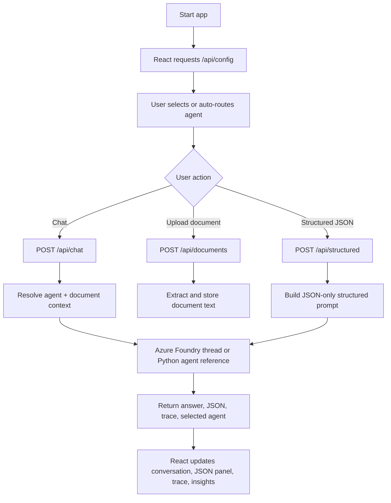

In short: the React app is the user workspace, Express is the secure orchestration layer, Azure AI Foundry is the reasoning backend, and the agent logic decides which specialist agent should handle each request.
