# Application Logic and AI Agents Logics

This document explains how this React + Express application works, how Azure login/authentication is handled, and how the AI agents are selected and executed. It also includes block diagrams and flowcharts for the main runtime flows.

## 1. Application Overview

The app is an enterprise AI assistant built with:

- React + Vite frontend at `http://127.0.0.1:5173` during development.
- Express backend at `http://127.0.0.1:5000`.
- Azure AI Foundry Agents through the `@azure/ai-agents` JavaScript SDK.
- Microsoft Entra ID authentication through `@azure/identity`.
- Optional Python agent-reference bridge for HR, IT, and ServiceNow agents.
- Server-side in-memory storage for sessions and uploaded document context.

The browser does not connect directly to Azure AI Foundry. It calls the local Express API. The backend owns Azure authentication, agent selection, thread creation, document extraction, agent execution, and response formatting.

## 2. High-Level Block Diagram

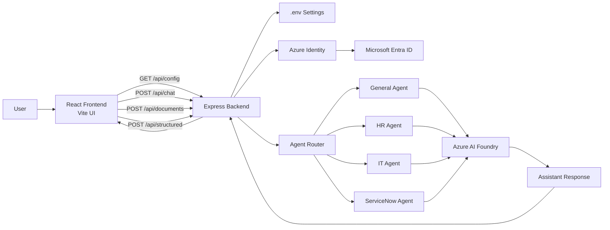

## 3. Application Startup Logic

When the application starts:

1. `npm run dev` starts both the Express server and Vite frontend.
2. Express loads `.env` through `dotenv`.
3. Express validates required Azure settings such as `AZURE_AI_PROJECT_ENDPOINT` and `AZURE_AI_AGENT_ID`.
4. Express creates an Azure credential.
5. Express creates an `AgentsClient`.
6. React loads runtime configuration from `GET /api/config`.
7. The UI displays agent options, runtime settings, chat, document upload, structured output, reasoning trace, and insights.

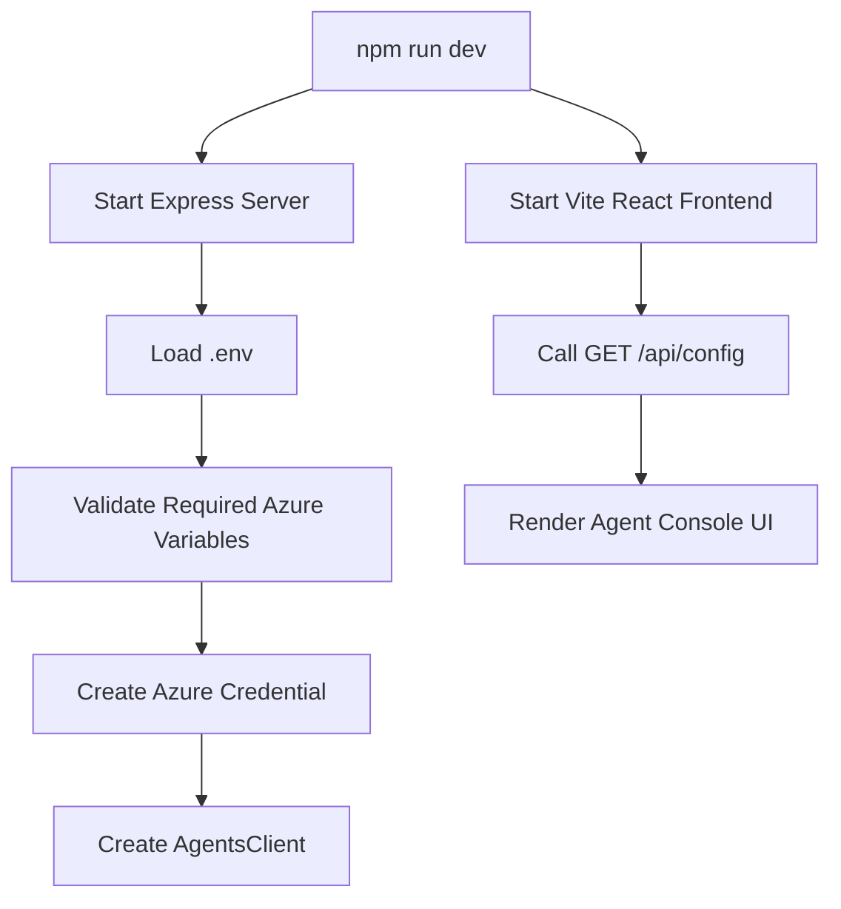

## 4. Login and Authentication Logic

The app does not have a browser login form. Authentication is handled on the backend using Microsoft Entra ID.

Before running locally, the developer signs in from the terminal:

```powershell
az login --tenant <tenant-id>
az account show
```

The signed-in account must have permission to access the Azure AI Foundry project.

Backend credential behavior:

- If `AZURE_AUTH_MODE=tenant_chain`, the server creates a `ChainedTokenCredential`.
- The chain tries Azure CLI, Azure PowerShell, Azure Developer CLI, and `DefaultAzureCredential`.
- If `AZURE_AUTH_MODE` is not `tenant_chain`, the server uses `DefaultAzureCredential`.
- If `AZURE_TENANT_ID` is configured, it is passed to the credential options.

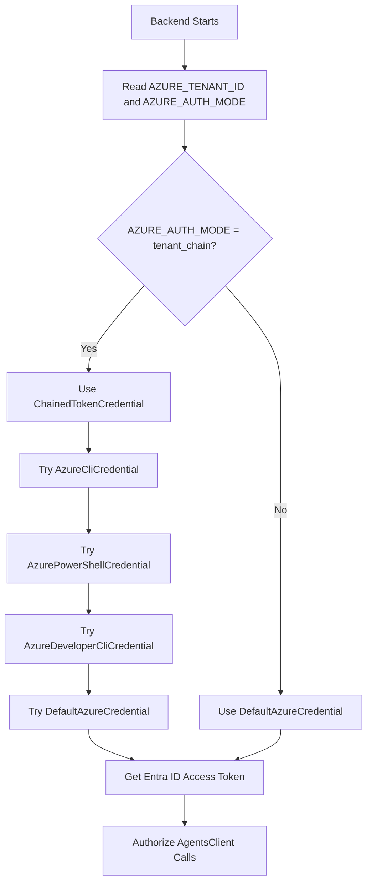

## 5. Main Runtime Components

| Component | File | Purpose |
| --- | --- | --- |
| React UI | `src/main.jsx` | Chat screen, agent selector, document upload, structured output, trace, and insights. |
| Express API | `server/index.js` | Local API layer for config, chat, documents, structured JSON, and session reset. |
| Azure credential logic | `server/index.js` | Creates Entra ID credentials for Azure AI Foundry access. |
| Agent router | `server/index.js` | Selects General, HR, IT, or ServiceNow based on request intent. |
| Document extraction | `server/index.js` | Extracts text from TXT, PDF, and DOCX uploads. |
| Python agent bridge | `server/hr-agent-reference.py` | Optional bridge for Azure AI Projects `agent_reference` calls. |

## 6. AI Agent Portfolio

The backend defines these logical agents:

| Agent Key | Default Name | Scope |
| --- | --- | --- |
| `general` | `Agent` | General reasoning |
| `hr` | `HRAgent` | HR policy and employee support |
| `it` | `ITAgent` | IT helpdesk and access support |
| `servicenow` | `ServNowAgent` | ServiceNow ticket guidance |

React receives this list from `GET /api/config` and shows it in the sidebar. The user can select an agent manually, but the backend can route the request automatically if the message clearly belongs to HR, IT, or ServiceNow.

## 7. Agent Routing Logic

The backend checks the user message for domain-specific terms.

Routing priority:

1. HR-related request -> HR agent.
2. ServiceNow-related request -> ServiceNow agent.
3. IT-related request -> IT agent.
4. No domain match -> selected UI agent, usually General.

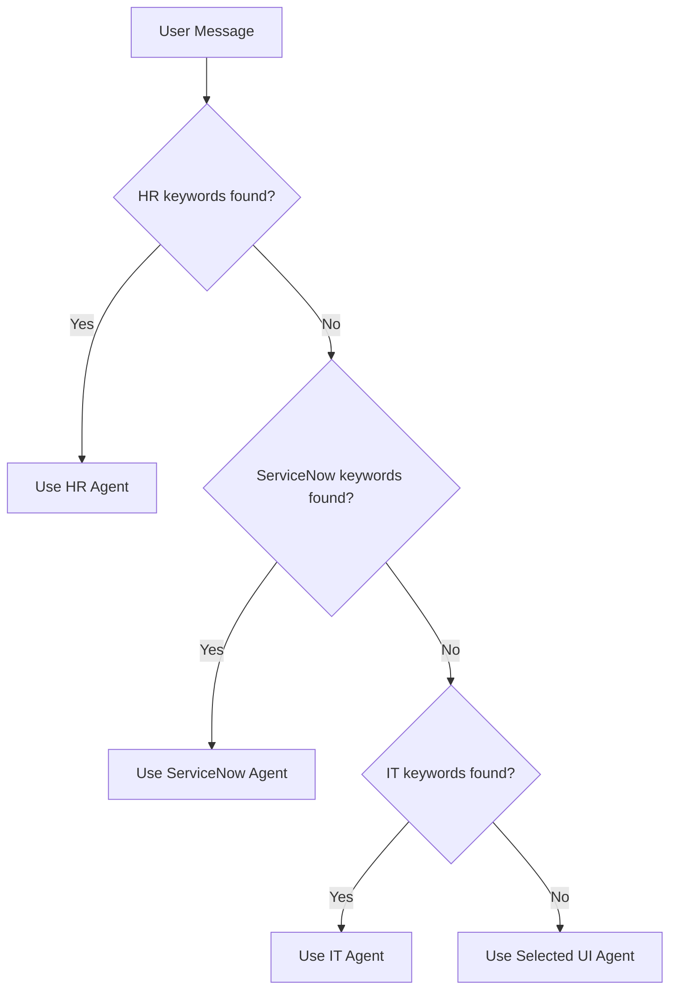

Example keyword areas:

- HR: leave, payroll, salary, benefits, onboarding, resignation, appraisal, WFH, employee policy.
- IT: VPN, laptop, password, access, MFA, software, network, email, Azure, error, incident.
- ServiceNow: ticket, incident, problem, change request, SLA, assignment group, CMDB, escalation, RCA.

## 8. Chat Flow

When the user sends a chat message:

1. React sends `POST /api/chat`.
2. Express validates the message.
3. Express resolves the best agent.
4. Express checks if any document context is attached to the session.
5. Express either calls the optional agent-reference bridge or uses the normal Azure AI Foundry agent thread.
6. Azure AI Foundry returns the assistant response.
7. Express returns the answer, selected agent, thread ID, and visible trace.
8. React displays the answer and trace.

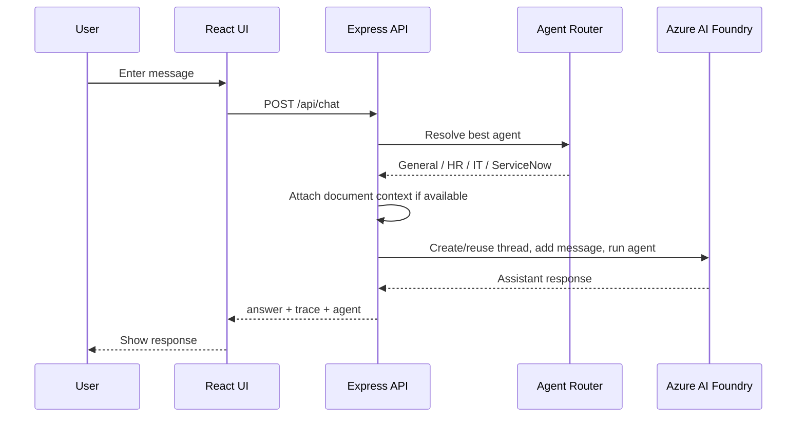

## 9. ReAct-Style Agent Logic

The app uses a ReAct-style pattern internally:

- Reason: Select the correct agent and decide the execution path.
- Act: Send the message to Azure AI Foundry or the agent-reference bridge.
- Observe: Check document context and agent run status.
- Final: Return the final assistant response.

The UI shows only a safe operational trace. It does not expose hidden chain-of-thought.

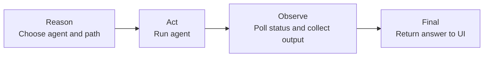

## 10. Normal Azure AI Foundry Thread Path

If no agent-reference name is configured for the selected agent, Express uses the normal `AgentsClient` thread-and-run flow.

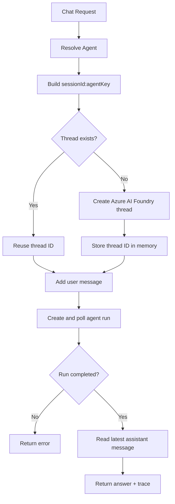

## 11. Optional Agent-Reference Path

For HR, IT, and ServiceNow, the backend can use an agent-reference path when these variables are configured:

- `AZURE_AI_HR_AGENT_REFERENCE_NAME`
- `AZURE_AI_IT_AGENT_REFERENCE_NAME`
- `AZURE_AI_SERVICENOW_AGENT_REFERENCE_NAME`

When configured, Express spawns `python server/hr-agent-reference.py`, sends JSON through stdin, and receives the answer through stdout.

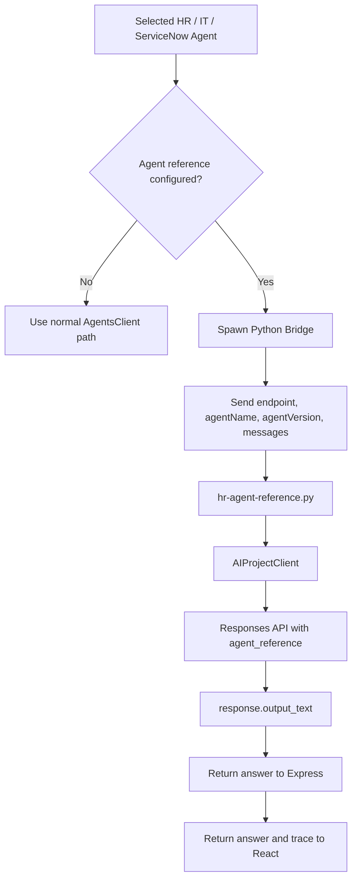

## 12. Document Upload and Q&A Logic

The sidebar allows uploads of PDF, DOCX, or TXT files.

Document flow:

1. React sends the file to `POST /api/documents`.
2. Express receives the file through `multer` memory storage.
3. Express extracts readable text.
4. Text is normalized.
5. The document is stored in memory using `sessionId:agentKey`.
6. Later chat and structured-output requests include this document text as context.
7. Resetting the thread clears the uploaded document context for that session.

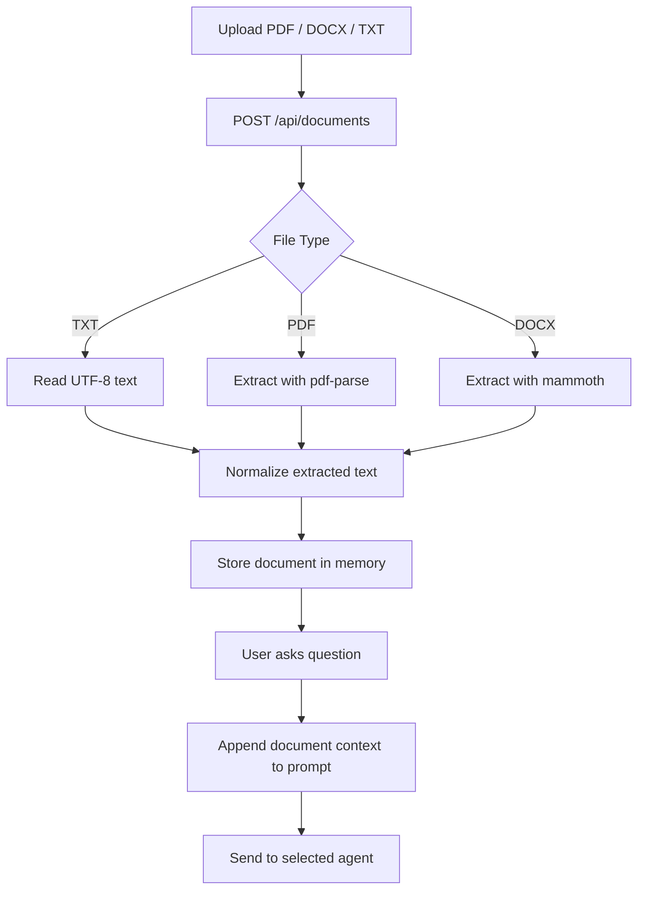

## 13. Structured Output Logic

The Structured Output tab generates API-ready JSON.

Available schemas:

- Service ticket.
- Action plan.
- Document summary.

Flow:

1. React sends `POST /api/structured` with `task`, `schemaKey`, `agentKey`, and `sessionId`.
2. Express selects the schema.
3. Express builds a JSON-only prompt.
4. Express resolves the best agent.
5. Express runs either the agent-reference path or the normal Azure AI Foundry path.
6. Express parses the output as JSON.
7. React displays the generated JSON.

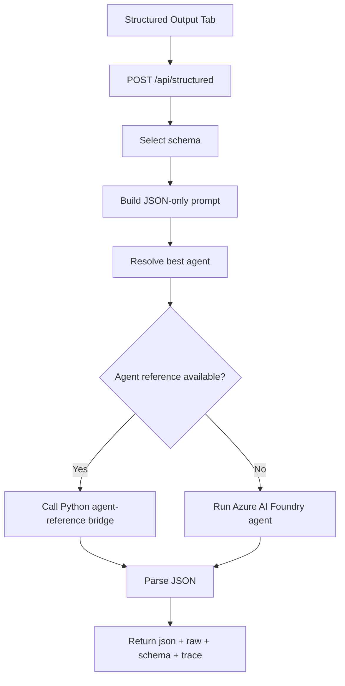

## 14. Session and Thread Logic

React creates a unique `sessionId` when the app loads. The backend combines `sessionId` and `agentKey` to manage separate Azure AI Foundry threads per agent.

Example key:

```text
session-1234567890-abcd:hr
```

Session behavior:

- Same session + same agent -> reuse the same Azure thread.
- Same session + different agent -> use a different thread.
- New thread button -> delete backend session data and create a new frontend session ID.

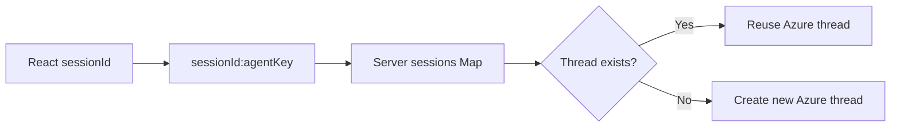

## 15. Reset Flow

When the user clicks New thread:

1. React calls `DELETE /api/session/:sessionId`.
2. Express deletes all stored thread IDs for that session.
3. Express deletes all uploaded document context for that session.
4. React creates a new `sessionId`.
5. The next request starts fresh.

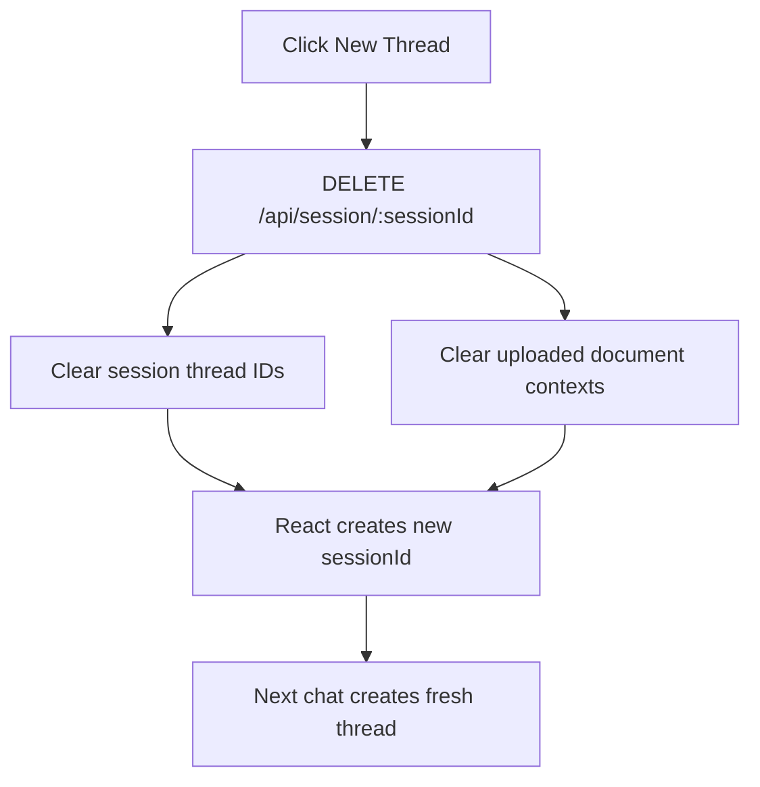

## 16. Important Environment Variables

| Variable | Purpose |
| --- | --- |
| `AZURE_AI_PROJECT_ENDPOINT` | Azure AI Foundry project endpoint. |
| `AZURE_AI_AGENT_ID` | Default/general Azure AI Foundry assistant ID. |
| `AZURE_AI_AGENT_NAME` | General agent display name. |
| `AZURE_AI_HR_AGENT_ID` | HR agent assistant ID. |
| `AZURE_AI_HR_AGENT_NAME` | HR agent display name. |
| `AZURE_AI_IT_AGENT_ID` | IT agent assistant ID. |
| `AZURE_AI_IT_AGENT_NAME` | IT agent display name. |
| `AZURE_AI_SERVICENOW_AGENT_ID` | ServiceNow agent assistant ID. |
| `AZURE_AI_SERVICENOW_AGENT_NAME` | ServiceNow agent display name. |
| `AZURE_AI_HR_AGENT_REFERENCE_NAME` | Optional HR agent-reference name. |
| `AZURE_AI_IT_AGENT_REFERENCE_NAME` | Optional IT agent-reference name. |
| `AZURE_AI_SERVICENOW_AGENT_REFERENCE_NAME` | Optional ServiceNow agent-reference name. |
| `AZURE_AI_AGENT_TEMPERATURE` | Temperature used for chat runs. |
| `AZURE_AI_AGENT_TOP_P` | Top P used for chat runs. |
| `AZURE_TENANT_ID` | Tenant ID for Azure credential options. |
| `AZURE_AUTH_MODE` | Use `tenant_chain` to try multiple local Azure credential sources. |
| `PORT` | Express backend port, default `5000`. |

## 17. Complete End-to-End Flow

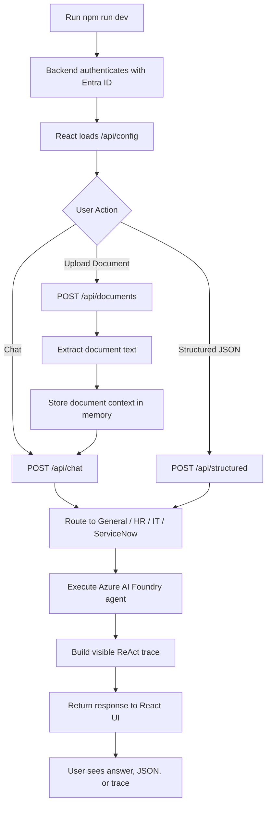

