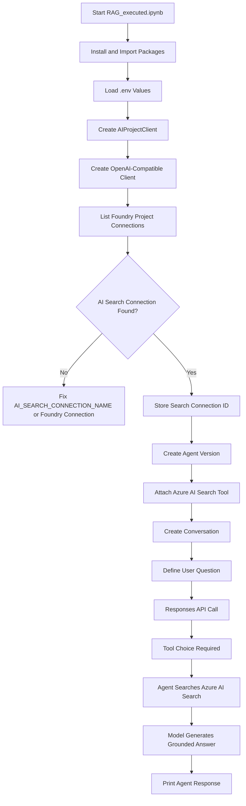
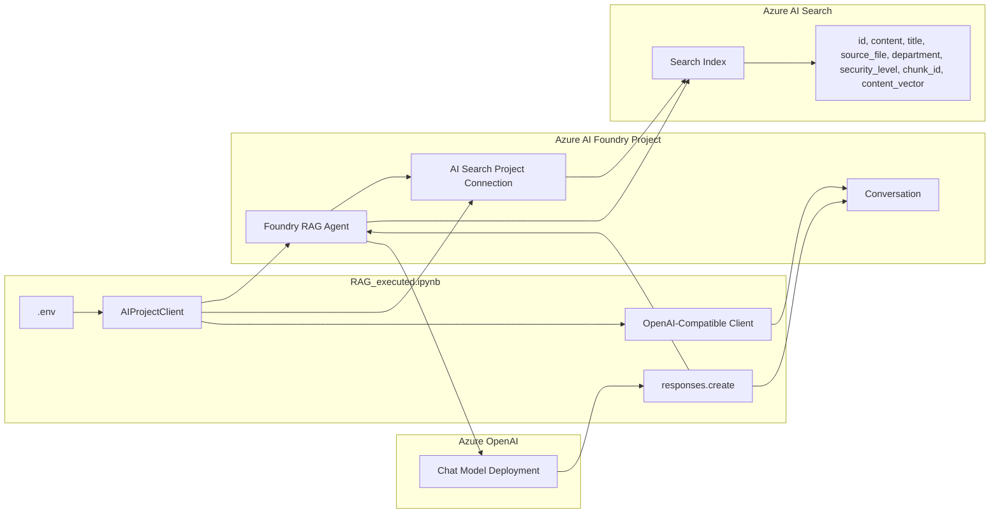
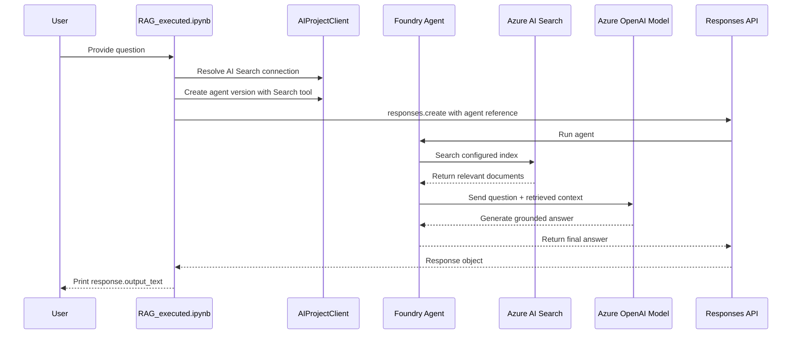

# Agent Logic

This document explains the Azure AI Foundry Agent RAG flow demonstrated by `RAG_executed.ipynb`.

The agent notebook creates a Foundry Agent, attaches Azure AI Search as a tool, starts a conversation, and calls the Responses API with an agent reference. The model answers only after using the configured search tool.

## Agent Responsibilities

1. Load project and search configuration from `.env`.
2. Connect to the Azure AI Foundry project.
3. Resolve the Azure AI Search project connection.
4. Create a Foundry Agent version.
5. Attach Azure AI Search as an agent tool.
6. Create a conversation.
7. Send the user question through the Responses API.
8. Require tool use.
9. Return a grounded answer with citations.

## High-Level Flow



## Schematic Block Diagram



## Wiring

| Notebook variable | Source | Used by |
| --- | --- | --- |
| `foundry_project_endpoint` | `FOUNDRY_PROJECT_ENDPOINT` | `AIProjectClient` |
| `model_deployment_name` | `MODEL_DEPLOYMENT_NAME` | Agent model |
| `ai_search_connection_name` | `AI_SEARCH_CONNECTION_NAME` | Foundry project connection lookup |
| `ai_search_index_name` | `AI_SEARCH_INDEX_NAME` | `AISearchIndexResource` |
| `connection_id` | Foundry project connection result | Agent Search tool |
| `agent` | `project_client.agents.create_version(...)` | Responses API agent reference |
| `conversation` | `openai_client.conversations.create()` | Responses API conversation |
| `user_input` | Notebook question cell | Responses API input |

## Retrieval Configuration

For the current index, use semantic retrieval:

```python
query_type = AzureAISearchQueryType.SEMANTIC
```

Why: the current Azure AI Search index has a normal vector field named `content_vector`, but it does not have an integrated vectorizer attached to the index. The Foundry Agent tool's `VECTOR_*` query types require an integrated vectorizer.

Avoid this for the current index:

```python
query_type = AzureAISearchQueryType.VECTOR_SEMANTIC_HYBRID
```

Use `VECTOR_SEMANTIC_HYBRID` only after the Azure AI Search index is recreated or updated with integrated vectorization support.

## Response API Wiring

The final response call requires tool use:

```python
response = openai_client.responses.create(
    tool_choice="required",
    conversation=conversation.id,
    input=user_input,
    extra_body={"agent": {"name": agent.name, "type": "agent_reference"}},
)
```

`tool_choice="required"` tells the runtime to call the configured agent tool before producing the answer.

The `extra_body` block tells the Responses API to use the Foundry Agent created earlier instead of making a direct model-only call.

## End-To-End Sequence



## How To Run

1. Open `RAG_executed.ipynb`.
2. Restart the kernel.
3. Run all cells from the top.
4. Confirm the agent creation cell prints the agent name, version, and ID.
5. Run the final response cell.

If the final cell still reports `vector_semantic_hybrid`, restart the kernel and rerun the agent creation cell. That error means the active in-memory agent still points to an older vector-hybrid configuration.
