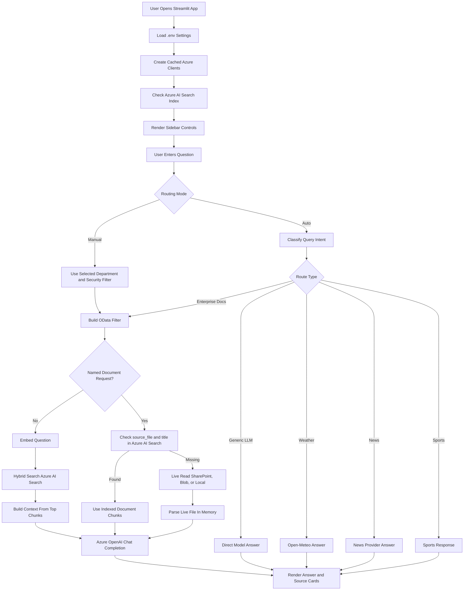
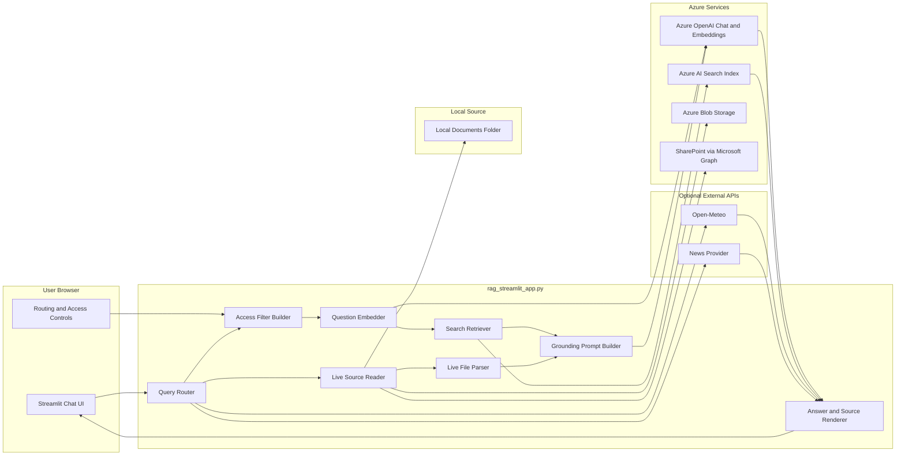
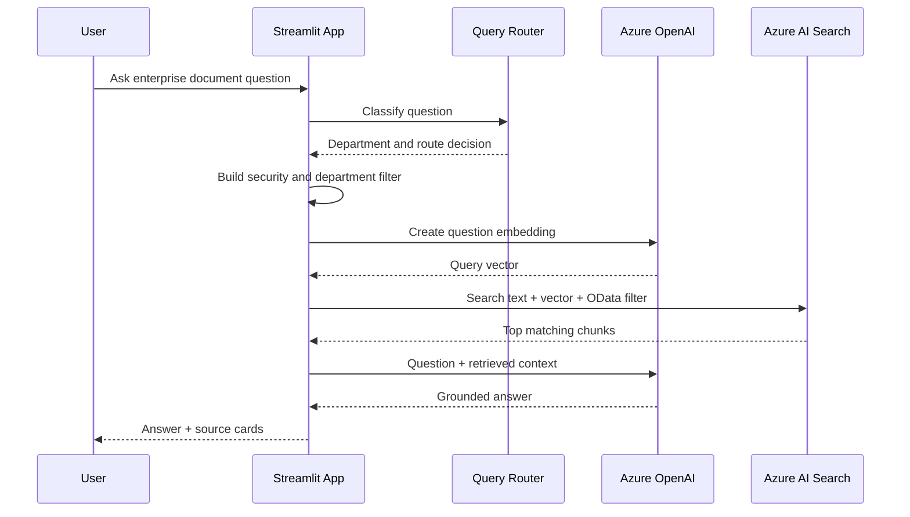
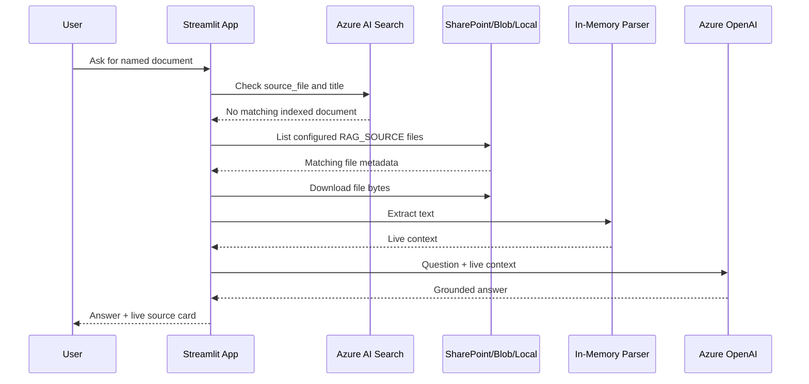

# Application Logic

This document explains the runtime logic of `rag_streamlit_app.py`.

The application is a Streamlit enterprise RAG assistant. It reads the already-populated Azure AI Search index, retrieves relevant chunks, sends those chunks to the Azure OpenAI chat model, and returns a grounded answer with source cards. For named document requests, it can also live-read SharePoint, Blob, or local files when the document is missing from Azure AI Search.

## Application Responsibilities

1. Render the chat UI and sidebar controls.
2. Validate the Azure AI Search index schema.
3. Route each question to the right answer path.
4. Apply department and security-level filters.
5. Embed enterprise document questions.
6. Retrieve matching chunks from Azure AI Search.
7. Live-read named SharePoint, Blob, or local documents when they are missing from the index.
8. Generate grounded answers through Azure OpenAI.
9. Display citations and source metadata.

## High-Level Flow



## Schematic Block Diagram



## Wiring

| Component | Code location | Wired to |
| --- | --- | --- |
| Streamlit page and sidebar | `st.set_page_config`, sidebar block | User controls, routing mode, access scope, sample prompts |
| OpenAI client | `get_openai_client()` | `AZURE_OPENAI_ENDPOINT`, `MODEL_DEPLOYMENT_NAME`, `EMBEDDING_DEPLOYMENT_NAME` |
| Search client | `get_search_client()` | `AI_SEARCH_SERVICE_ENDPOINT`, `AI_SEARCH_INDEX_NAME`, `AI_SEARCH_API_KEY` |
| Index summary | `get_index_summary()` | Validates required fields and displays source metadata |
| Access filter | `build_access_filter()` | Builds OData filter using `department` and `security_level` |
| Query router | `route_query()` | Selects enterprise RAG, generic LLM, weather, news, or sports path |
| Embedding | `embed_question()` | Generates query vector from Azure OpenAI embedding deployment |
| Retrieval | `retrieve()` | Runs Azure AI Search hybrid/vector retrieval over `content_vector` |
| Named document lookup | `retrieve_named_document()` | Checks indexed `source_file` and `title` before normal retrieval |
| Live fallback | `retrieve_live_named_document()` | Lists, downloads, and parses named documents from `RAG_SOURCE` sources when missing from the index |
| Live parsers | `parse_live_document()` | Extracts text from `.txt`, `.md`, `.csv`, `.log`, `.pdf`, `.docx`, `.xlsx`, and `.xlsm` |
| Answer generation | `answer_question()` | Sends retrieved chunks to chat model for grounded response |
| Source rendering | `render_source_cards()` | Displays `source_file`, `chunk_id`, `department`, and `security_level` |

## Enterprise RAG Path



## Live Fallback Path

Live fallback runs only for named document requests when the document is not found in the current Azure AI Search index.



## Search Index Contract

The app expects the Azure AI Search index to contain these fields:

```text
id
content
title
source_file
department
security_level
chunk_id
content_vector
```

The current index uses `content_vector` with 1536 dimensions.

## Access Scope Logic

Manual mode uses the sidebar selections directly.

Auto mode routes by question intent:

| Query type | Route behavior |
| --- | --- |
| HR, employee, payroll, benefits, leave | Search HR documents |
| IT, helpdesk, security, access | Search IT documents |
| Mixed or broad enterprise query | Search all permitted departments |
| Greeting | Lightweight greeting response |
| Weather | Open-Meteo path |
| News/current events | Configured news provider path |
| Generic non-document query | Direct LLM path |

The app still applies `security_level` filtering in the enterprise RAG path.

## Run Command

```powershell
streamlit run .\rag_streamlit_app.py
```

Open the local URL printed by Streamlit, usually `http://localhost:8501`.
