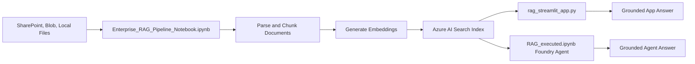

# Enterprise RAG Pipeline

This project demonstrates two related RAG paths:

1. `Enterprise_RAG_Pipeline_Notebook.ipynb` builds the enterprise ingestion, indexing, retrieval, grounded answering, and evaluation pipeline.
2. `RAG_executed.ipynb` demonstrates the Azure AI Foundry Agent flow that connects a Foundry Agent to Azure AI Search and answers through the Responses API.
3. `rag_streamlit_app.py` provides an end-user Streamlit application over the indexed enterprise content.

Use this document as the README entry point.

## Files

| File | Purpose |
| --- | --- |
| `Enterprise_RAG_Pipeline_Notebook.ipynb` | Main notebook for source loading, parsing, chunking, embeddings, Azure AI Search indexing, retrieval, answer generation, and evaluation. |
| `RAG_executed.ipynb` | Executed Foundry Agent RAG notebook showing the agent, conversation, and response flow. |
| `rag_streamlit_app.py` | Streamlit chat application for enterprise RAG with routing, filters, citations, weather, and news handling. |
| `APPLICATION-LOGIC.md` | Streamlit application logic, schematic block diagram, and wiring. |
| `AGENT-LOGIC.md` | Foundry Agent notebook logic, schematic block diagram, and wiring. |
| `requirements.txt` | Python package dependencies. |
| `.env` | Local configuration and secrets. Do not commit real secrets. |

## Prerequisites

Install dependencies:

```powershell
python -m pip install -r requirements.txt
```

Sign in to Azure if using `DefaultAzureCredential`:

```powershell
az login
```

The notebooks and app expect these common settings in `.env`:

```text
FOUNDRY_PROJECT_ENDPOINT="<your-foundry-project-endpoint>"
AZURE_OPENAI_ENDPOINT="<your-azure-openai-endpoint>"
MODEL_DEPLOYMENT_NAME="<your-chat-model-deployment>"
EMBEDDING_DEPLOYMENT_NAME="<your-embedding-model-deployment>"
AI_SEARCH_SERVICE_ENDPOINT="<your-ai-search-service-endpoint>"
AI_SEARCH_INDEX_NAME="ajay-enterprise-rag-demo11"
AI_SEARCH_API_KEY="<your-ai-search-admin-or-query-key>"
AI_SEARCH_CONNECTION_NAME="<your-foundry-ai-search-connection-name>"
RAG_LIVE_FALLBACK="true"
```

## Run `Enterprise_RAG_Pipeline_Notebook.ipynb`

Use this notebook when you want to create or refresh the Azure AI Search index.

1. Open `Enterprise_RAG_Pipeline_Notebook.ipynb`.
2. Restart the notebook kernel.
3. Run cells from the top through configuration validation.
4. Choose your document source in `.env`.
5. Preview the parsed documents.
6. Set `RUN_INGEST = True` in the ingestion cell.
7. Run the ingestion cell to create or update the Azure AI Search index.
8. Run the retrieval, grounded answer, and evaluation cells.

Supported source values:

```text
RAG_SOURCE="sharepoint,blob,local"
RAG_SOURCE="all"
RAG_SOURCE="sharepoint"
RAG_SOURCE="blob"
RAG_SOURCE="local"
```

For local documents:

```text
RAG_DOCS_DIR="./data/documents"
```

For Blob Storage:

```text
BLOB_CONTAINER_URL="https://<storage-account>.blob.core.windows.net/<container>"
```

For SharePoint:

```text
AZURE_TENANT_ID="<tenant-id>"
SHAREPOINT_CLIENT_ID="<app-client-id>"
SHAREPOINT_CLIENT_SECRET="<client-secret-value>"
SHAREPOINT_HOSTNAME="<tenant>.sharepoint.com"
SHAREPOINT_SITE_PATH="/sites/<site-name>"
SHAREPOINT_DRIVE_NAME="Documents"
```

SharePoint app permissions normally required:

```text
Sites.Read.All
Files.Read.All
```

Grant admin consent after adding the permissions.

## Run `RAG_executed.ipynb`

Use this notebook when you want to demonstrate the Foundry Agent path.

1. Open `RAG_executed.ipynb`.
2. Restart the kernel before rerunning cells.
3. Run all cells from the top.
4. Confirm the agent creation cell prints an agent name and version.
5. Confirm the final response cell prints `Agent Response: ...`.

Important: run the agent creation cell before the final response cell. If you only rerun the final cell, the notebook kernel may reuse an old in-memory `agent` variable.

For the current Azure AI Search index, the agent tool should use semantic retrieval:

```python
query_type = AzureAISearchQueryType.SEMANTIC
```

Do not use `AzureAISearchQueryType.VECTOR_SEMANTIC_HYBRID` unless the Azure AI Search index has an integrated vectorizer configured. A normal vector field such as `content_vector` is not enough for the Foundry Agent tool's integrated vector query mode.

## Run The Streamlit App

Use the Streamlit app after the index has been populated.

```powershell
streamlit run .\rag_streamlit_app.py
```

Open the local URL shown by Streamlit, usually:

```text
http://localhost:8501
```

The app includes:

- chat-style enterprise RAG UI
- index health summary
- department and security-level filters
- live fallback for named SharePoint, Blob, or local documents that are not yet indexed
- automatic routing for HR, IT/helpdesk, enterprise-wide, generic LLM, weather, news, and sports questions
- sample business questions
- grounded answers with source cards
- production notes for Microsoft Entra ID and user-claim based filtering

Optional news support:

```text
NEWS_PROVIDER="NewsAPI"
NEWSAPI_KEY="<your-newsapi-key>"
GNEWS_API_KEY="<your-gnews-key>"
THENEWSAPI_KEY="<your-thenewsapi-key>"
```

Weather support uses Open-Meteo and does not require an API key.

## Live Read Fallback

The Streamlit app now supports indexed retrieval plus live fallback.

```text
User asks for a named document
        ↓
App checks Azure AI Search
        ↓
If the document is missing from the index
        ↓
App checks live sources from RAG_SOURCE
        ↓
App downloads and parses the matching file in memory
        ↓
Model answers from live content
```

Enable or disable live fallback:

```text
RAG_LIVE_FALLBACK="true"
```

The live fallback checks sources in the order configured by `RAG_SOURCE`:

```text
RAG_SOURCE="sharepoint,blob,local"
```

Supported live-read file types:

```text
.txt, .md, .csv, .log, .pdf, .docx, .xlsx, .xlsm
```

Live fallback is intended for named document requests, for example:

```text
Summarize Professional_Etiquette_in_IT
Please check SharePoint: Professional Etiquette in IT document
```

It does not update Azure AI Search automatically. For fast future retrieval, rerun ingestion in `Enterprise_RAG_Pipeline_Notebook.ipynb`.

## Supported File Types

| File type | Support method |
| --- | --- |
| `.txt`, `.md`, `.csv`, `.log` | Direct text decoding |
| `.pdf` | Text extraction with PyMuPDF |
| `.xlsx`, `.xlsm` | Sheet and cell extraction with openpyxl |
| `.docx` | Paragraph and table extraction with python-docx |
| `.png`, `.jpg`, `.jpeg`, `.bmp`, `.gif`, `.tif`, `.tiff`, `.webp` | Image text or description extraction using the configured vision-capable chat model deployment |

Important: `.xlsm` macro code is not executed or interpreted. The notebook reads workbook cell values only. Scanned PDFs may need OCR or Azure Document Intelligence if PyMuPDF cannot extract text.

## End-To-End Schematic



## Production Notes

- Use a dedicated enterprise index name, such as `ajay-enterprise-rag-demo11`.
- Do not reuse an index that has a different schema.
- Use Microsoft Entra ID and managed identity where possible.
- Move secrets to Azure Key Vault for production.
- Add user and group metadata fields for row-level access control.
- Derive filters from the signed-in user's claims or groups instead of free-form UI selections.
- Use Azure Document Intelligence for scanned PDFs, forms, tables, and complex layouts.
