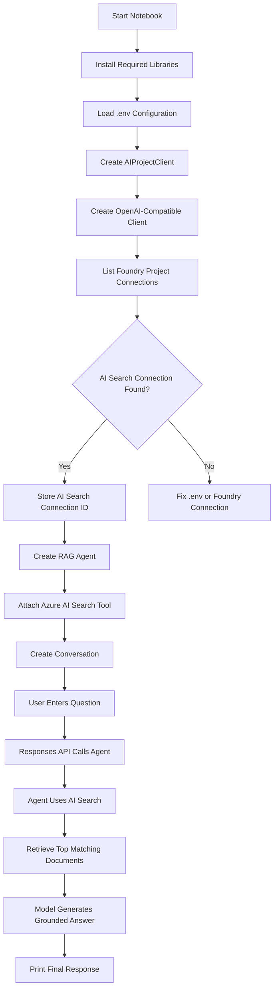
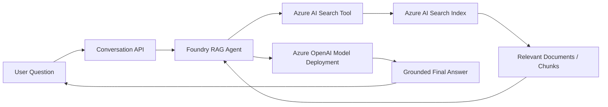
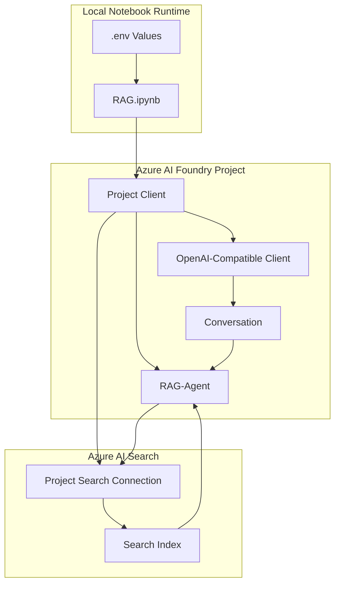
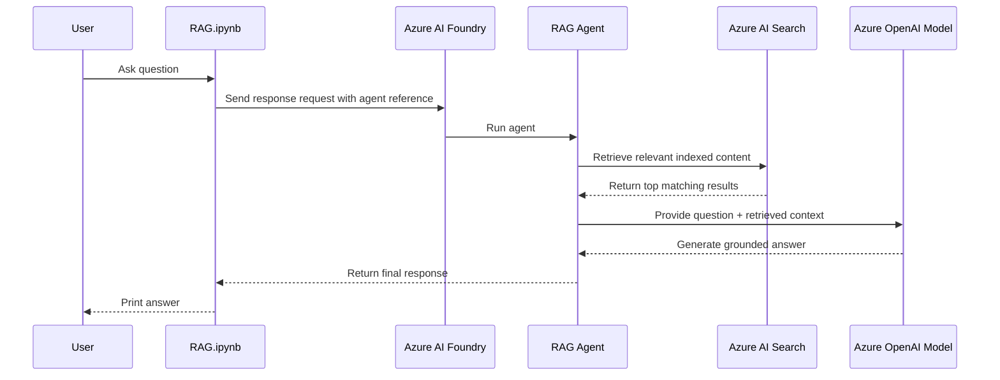

# RAG Application Logic

This file explains the logic used by `RAG.ipynb`. The notebook builds a Retrieval-Augmented Generation application where an Azure AI Foundry Agent uses Azure AI Search to retrieve relevant content before generating the final answer.

## Application Goal

The goal is to let users ask questions about indexed business documents, such as ABC Corp HR policy Document etc.. Instead of answering only from the model's built-in knowledge, the agent first searches Azure AI Search and then uses the retrieved results as grounding context.

## High-Level Logic

1. Load required Python libraries.
2. Read configuration values from `.env`.
3. Connect to the Azure AI Foundry project.
4. Create an OpenAI-compatible client from the Foundry project.
5. Find the Azure AI Search connection registered in the Foundry project.
6. Create a RAG agent and attach Azure AI Search as a tool.
7. Create a conversation session.
8. Send a user question to the agent.
9. Force the agent to use the search tool.
10. Return a grounded answer with retrieved context.

## Flowchart



## Block Diagram



## Schematic View



## Cell-by-Cell Logic Summary

| Cell | Purpose |
| --- | --- |
| 1 | Introduces the RAG notebook and overall objective. |
| 2 | Shows the lab architecture image. |
| 3 | Explains dependency installation. |
| 4 | Installs required Python packages. |
| 5 | Explains environment variable setup. |
| 6 | Imports SDK classes and loads `.env` values. |
| 7 | Explains Foundry project client creation. |
| 8 | Creates `AIProjectClient` using Azure credentials. |
| 9 | Explains OpenAI client creation. |
| 10 | Creates the OpenAI-compatible client. |
| 11 | Explains Azure AI Search connection lookup. |
| 12 | Finds the AI Search connection ID from project connections. |
| 13 | Explains RAG agent creation. |
| 14 | Creates a Foundry Agent and attaches Azure AI Search as a retrieval tool. |
| 15 | Explains conversation object creation. |
| 16 | Creates a conversation session. |
| 17 | Explains user query and response call. |
| 18 | Defines the user question. |
| 19 | Sends the question to the agent and prints the grounded response. |

## Retrieval Logic

The agent uses `AzureAISearchAgentTool` with `AzureAISearchQueryType.VECTOR_SEMANTIC_HYBRID`.

That means retrieval combines:

- Vector search for semantic similarity.
- Semantic ranking for better relevance ordering.
- Keyword matching for exact term matches.

The notebook sets `top_k = 3`, so the search tool returns the top three most relevant results to the model.

## Response Logic

The response call uses:

```python
tool_choice="required"
```

This forces the agent to use its configured tool. Since the configured tool is Azure AI Search, the model must retrieve search results before producing the final answer.

The agent is referenced through:

```python
extra_body={"agent": {"name": agent.name, "type": "agent_reference"}}
```

This tells the Responses API to run the request through the created Foundry Agent instead of calling the model directly.

## End-to-End Sequence



## Key Configuration Values

The notebook expects these values in `.env`:

```text
FOUNDRY_PROJECT_ENDPOINT=<your-foundry-project-endpoint>
MODEL_DEPLOYMENT_NAME=<your-model-deployment-name>
AI_SEARCH_CONNECTION_NAME=<your-ai-search-connection-name>
AI_SEARCH_INDEX_NAME=<your-ai-search-index-name>
```

These values control which Foundry project, model deployment, AI Search connection, and search index the notebook uses.
