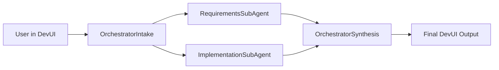
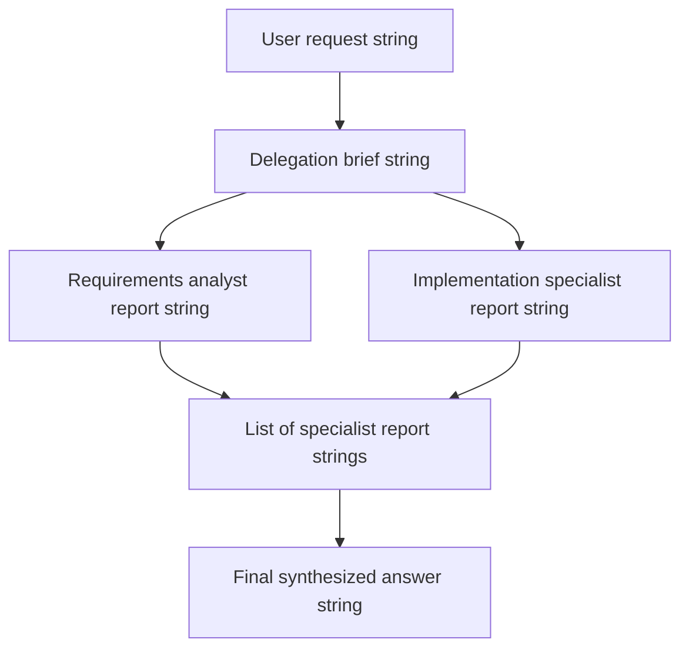

# Application Logic: Orchestrator and Sub-Agents DevUI

Source file: `orchestrator_agent_and_sub-agent-devui.py`

## Purpose

This application demonstrates an orchestrator pattern in Microsoft Agent Framework DevUI. One orchestrator agent receives the user request, prepares a delegation brief, sends the brief to two specialist sub-agents in parallel, then synthesizes both specialist outputs into one final answer.

## Runtime Wiring



## Agent Roles

| Component | Executor class | Agent used | Responsibility |
| --- | --- | --- | --- |
| Orchestrator intake | `OrchestratorIntakeExecutor` | `DevUI-Orchestrator-Agent` | Converts the raw user request into a delegation brief. |
| Requirements analyst | `RequirementsAnalystExecutor` | `DevUI-Requirements-Agent` | Extracts goals, constraints, risks, assumptions, and acceptance criteria. |
| Implementation specialist | `ImplementationSpecialistExecutor` | `DevUI-Implementation-Agent` | Produces practical implementation guidance, commands, controls, and verification steps. |
| Orchestrator synthesis | `OrchestratorSynthesisExecutor` | `DevUI-Orchestrator-Agent` | Combines specialist reports into one implementation-ready response. |

## Step-by-Step Flow

1. The DevUI sends the user's text input to `OrchestratorIntake`.
2. `OrchestratorIntakeExecutor.handle()` asks the orchestrator agent to prepare a delegation brief.
3. `WorkflowBuilder.add_fan_out_edges()` sends that same brief to both sub-agents:
   - `RequirementsSubAgent`
   - `ImplementationSubAgent`
4. Both sub-agents run independently and return specialist reports.
5. `WorkflowBuilder.add_fan_in_edges()` waits until both reports are available.
6. `OrchestratorSynthesisExecutor.handle()` joins the reports, removes duplication, reconciles conflicts, and yields the final answer back to DevUI.

## Workflow Builder Wiring

```python
workflow = (
    WorkflowBuilder(
        name="Orchestrator and Sub-Agents",
        description="An orchestrator delegates work in parallel and synthesizes the specialist reports.",
    )
    .set_start_executor(intake)
    .add_fan_out_edges(intake, [requirements, implementation])
    .add_fan_in_edges([requirements, implementation], synthesis)
    .build()
)
```

## Data Shape

This version passes plain strings between executors:



## Azure Foundry Connection

Each agent is created by `create_agent()`:

1. Loads `FOUNDRY_PROJECT_ENDPOINT` and `MODEL_DEPLOYMENT_NAME` from `.env`.
2. Authenticates with `AzureCliCredential`.
3. Creates an `AIProjectClient`.
4. Creates a conversation.
5. Wraps the project client with `AzureAIClient`.
6. Creates a framework agent with a name and instruction prompt.

## DevUI Entry Point

```python
serve(entities=[workflow], port=8091, auto_open=True, tracing_enabled=True)
```

The app runs at:

```text
http://localhost:8091
```

## Key Idea

This is a clean orchestrator-plus-specialists pattern:

- The orchestrator decides how work should be delegated.
- Specialist agents work in parallel.
- The orchestrator owns the final answer.
- DevUI shows the workflow graph and traces each executor call.
