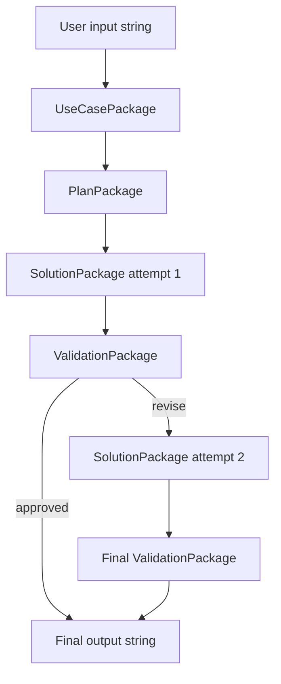

# Application Logic: A2A Local/Remote Planner, Executor, Validator DevUI

Source file: `orchestrator_agent_and_sub-agent_v2-devui.py`

## Purpose

This application demonstrates a richer multi-agent workflow where a local planner coordinates with remote A2A-style executor and validator agents. The workflow is intentionally named so Microsoft Agent Framework DevUI shows local nodes, remote A2A nodes, and protocol handoff nodes in the block diagram.

## Runtime Wiring

```mermaid
flowchart LR
    User[User in DevUI] --> Selector[LOCAL_UI_UseCaseSelector]
    Selector --> Planner[LOCAL_PlannerAgent]
    Planner --> PlanHandoff[A2A_SendPlanToRemoteExecutor]
    PlanHandoff --> Executor[REMOTE_A2A_ExecutorAgent]
    Executor --> SolutionHandoff[A2A_SendSolutionToRemoteValidator]
    SolutionHandoff --> Validator[REMOTE_A2A_ValidatorAgent]
    Validator -->|Approved| Publisher[LOCAL_PublishResult]
    Validator -->|Revise| Revision[REMOTE_A2A_ExecutorRevision]
    Revision --> RevisionHandoff[A2A_SendRevisionToFinalValidator]
    RevisionHandoff --> FinalValidator[REMOTE_A2A_FinalValidator]
    FinalValidator --> Publisher
    Publisher --> Final[Final DevUI Output]
```



## Agent and Handoff Roles

| Component | Executor class | Role |
| --- | --- | --- |
| `LOCAL_UI_UseCaseSelector` | `LocalUseCaseSelectorExecutor` | Parses the user's use-case selection and creates the first package. |
| `LOCAL_PlannerAgent` | `PlannerExecutor` | Creates a numbered, dependency-aware plan. |
| `A2A_SendPlanToRemoteExecutor` | `A2APlanHandoffExecutor` | Marks the A2A handoff from local planner to remote executor. |
| `REMOTE_A2A_ExecutorAgent` | `SolutionExecutor` | Implements the planned solution. |
| `A2A_SendSolutionToRemoteValidator` | `A2ASolutionHandoffExecutor` | Marks the A2A handoff from remote executor to remote validator. |
| `REMOTE_A2A_ValidatorAgent` | `ValidatorExecutor` | Reviews the solution and returns `DECISION: APPROVED` or `DECISION: REVISE`. |
| `REMOTE_A2A_ExecutorRevision` | `RevisionExecutor` | Revises the solution if the validator requests changes. |
| `A2A_SendRevisionToFinalValidator` | `A2ARevisionHandoffExecutor` | Marks the revised-solution handoff to the final validator. |
| `REMOTE_A2A_FinalValidator` | `ValidatorExecutor` | Performs the final validation after one revision attempt. |
| `LOCAL_PublishResult` | `PublisherExecutor` | Formats the final collaboration result for DevUI. |

## Use-Case Selection

The app supports four built-in use cases:

| Key | Title |
| --- | --- |
| `1` | A2A remote Azure implementation |
| `2` | A2A remote code review |
| `3` | A2A remote incident response |
| `4` | A2A remote architecture validation |

Supported DevUI inputs:

```text
1
use_case=2
2: add private endpoint and monitoring
any free-form request
```

If the input is free-form, the app defaults to use case `1` and treats the full input as the request.

## Data Packages

Unlike the first version, v2 passes structured dataclass packages between executors.



### Package Responsibilities

| Package | Carries |
| --- | --- |
| `UseCasePackage` | Original request, selected use-case key/title, A2A flag, routing notes. |
| `PlanPackage` | Request, use-case title, routing notes, generated plan. |
| `SolutionPackage` | Request, title, routing notes, plan, solution, attempt number, optional feedback. |
| `ValidationPackage` | Request, title, routing notes, plan, solution, review text, approval flag, attempt number. |

## Step-by-Step Flow

1. The user enters a use-case key or custom request in DevUI.
2. `LocalUseCaseSelectorExecutor` parses the input and emits a `UseCasePackage`.
3. `PlannerExecutor` asks the local planner agent to create a plan.
4. `A2APlanHandoffExecutor` forwards the plan and prints a handoff message.
5. `SolutionExecutor` asks the remote executor agent to produce a complete solution.
6. `A2ASolutionHandoffExecutor` forwards the solution to validation.
7. `ValidatorExecutor` asks the remote validator to review the solution.
8. If the validator says `DECISION: APPROVED`, the result goes directly to `PublisherExecutor`.
9. If the validator says `DECISION: REVISE`, `RevisionExecutor` asks the executor agent to produce a replacement solution.
10. The revised solution is handed to `REMOTE_A2A_FinalValidator`.
11. `PublisherExecutor` emits the final answer, route notes, solution, and validator review.

## Conditional Routing

```python
def is_approved(package: ValidationPackage) -> bool:
    return package.approved


def needs_revision(package: ValidationPackage) -> bool:
    return not package.approved
```

The validator sets `approved` by checking whether the model response contains:

```text
DECISION: APPROVED
```

## Workflow Builder Wiring

```python
workflow = (
    WorkflowBuilder(
        name="A2A Local Remote Planner Executor Validator",
        description="Choose an A2A use case in the input box, then run a visible local/remote workflow.",
    )
    .set_start_executor(use_case_selector)
    .add_edge(use_case_selector, planner)
    .add_edge(planner, a2a_plan_handoff)
    .add_edge(a2a_plan_handoff, executor)
    .add_edge(executor, a2a_solution_handoff)
    .add_edge(a2a_solution_handoff, validator)
    .add_edge(validator, publisher, condition=is_approved)
    .add_edge(validator, revision, condition=needs_revision)
    .add_edge(revision, a2a_revision_handoff)
    .add_edge(a2a_revision_handoff, final_validator)
    .add_edge(final_validator, publisher)
    .build()
)
```

## Azure Foundry Connection

Each framework agent is created through the same helper:

1. Reads `.env` values:
   - `FOUNDRY_PROJECT_ENDPOINT`
   - `MODEL_DEPLOYMENT_NAME`
2. Authenticates with `AzureCliCredential`.
3. Creates an async `AIProjectClient`.
4. Creates a conversation.
5. Creates an `AzureAIClient` bound to that conversation and model deployment.
6. Creates an agent with a role-specific instruction prompt.

## DevUI Entry Point

```python
serve(entities=[workflow], port=8092, auto_open=True, tracing_enabled=True)
```

The app runs at:

```text
http://localhost:8092
```

## Key Idea

This version demonstrates a local-to-remote A2A coordination pattern:

- Local DevUI selects a scenario.
- A local planner prepares the work.
- A2A handoff nodes make protocol movement visible.
- Remote executor and validator agents collaborate.
- A conditional edge decides whether the answer is published or revised.
- The workflow allows one revision before publishing the final result.
